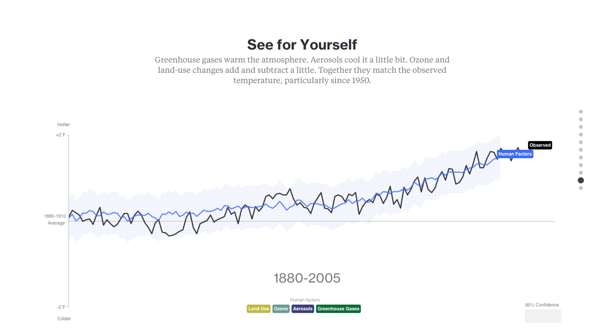
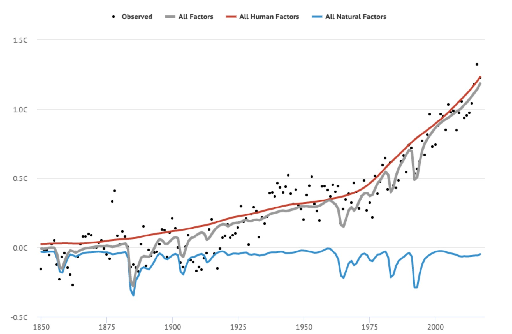

# Self-Study-Project
Self study project for MSIS 2629 Visualization 

According to Jacqueline Strecker's paper:
Jacqueline Strecker(2012): Data Visualization in Review;  (https://idl-bnc-idrc.dspacedirect.org/bitstream/handle/10625/49286/IDL-49286.pdf?sequence=1&isAllowed=y)

### Framework

>Clarity | Is the charting form appropriate? Are titles appropriate? Are the units of the data familiar to the intended audience? Does the visualization anticipate the questions it raises?

>Focus | Does the language used in the visualization support at least one specific idea? Do design choices such as colors, typography or highlighted areas support at least one specific idea? In more complicated visualizations, is it clear that some parts of the information are more important than other parts?

>Compelling | Will your audience want to talk about or act upon this data? Does the richness of the data justify a visualization? Would incorporating photography or annotations make the data more relatable?

Based on the framework given in the paper, I further divided the three main review criterias into categories below:

**Simplicity of the visualization**

**Proper selection of chart form and text appropriateness**

**Clear message/idea in the visualization**

**Compellingness of the visualization**

I will then utilize these 5 categories of visualization and the 3 framework provided from the literature paper to analyze and critique the 5 graphs that I have found related to climate change and human activity.

## Graph Analysis

### Graph 1

[reference_link](https://www.bloomberg.com/graphics/2015-whats-warming-the-world/)

#### Evaluation
This visualization definitely meets the simplicity criteria of the framework; the visualization utilizes different lines for different aspects of human or natural factor that has caused temperature change, and eventually these aspects will merge into two lines, one is human factor and one is natural factor. The black line demonstrates the data observed of climate change. All the lines are well_labeled with the color-coded legends that are on the graph (lines) itself, and colored legends are provided at the bottom of the graph as well for reference. The graph also provided the information that the shaded regions represent the 95% confidence interval of the modeled human factor line. The units that are introduced in the x and y axis are easy to understand as well. The text and title that goes with the graph highlights the different aspects of the human factor and how they have affected the temperature. The message is clear that human factors are the primary factor that's caused the climate change. The visualization is extremely compelling with the animated gif form where the different aspects of human factors eventually combines into one line and it overlaps with the obsreved lines, allowing the readers to visualize how recent years of indsutrial development has resulted in the increase in temperature, and thus motivates people(readers) to rethink the harm that we have done and act upon this graph. 

### Graph 2

[reference_link](https://19january2017snapshot.epa.gov/climate-change-science/causes-climate-change_.html)

#### Evaluation
In terms of the second graph, the charting form is still appropriate, utilizing a line to connect all the observed data points, and instead of using the fitted lines for the natrual factor and human factor, this graph decided to employ shades to convey the general trend/pattern of natrual factor only and natural and human factors combined. The title of the graph can be slightly misleading, because in the graph, natural and human factors are introduced as an combined effect rather than one for natrual and one for human, instead its natural factor only and the combined factor. The graph illustrates that approximately in the 1970s the human factor drives up the global temperature change and it diviates from the natural factor only shades. This use of highlighted area support the main idea that human factors are the driving up the global temperature change fluctuation, where the natural factor alone isn't really causing an effect. The visualization delivers in terms of compelling, as it shows the large contrast of global temperature increase with and without the human factor, really highlighting the fact that human factors are the major contributor to global temperature increase. Overall a great visualization, one addition that could make the graph better would probably introduce a caption on the side perhaps explaining what happened from the 1970s and onwards that caused the dramatic increase in temperature that were caused by human factors, and then people would perhaps act upon it and cut down the CO2 emission etc.

### Graph 3

[reference_link](https://skepticalscience.com/a-comprehensive-review-of-the-causes-of-global-warming.html)

#### Evaluation
This visualization is shows 6 different studies on climate change, and the human and natural percentage contribution towards global warming that each study found. 
This graph is troublesome to understand at the first glance. The color coding doesn't really reflect any meaning, and the legend doesn't clarify what each colored bar represents. Without reading the entire website, you won't be able to understand what each study is about and how it came up with this graph. The chart selection and the title is appropriate, but the units can be misleading, as usually the contributions from different factor should add up to 100% but in this graph's case many exceeds 100% and provided no explicit explanation on why it happened.
The idea that the graph is trying to convey is clear, that human factors overwhelming outpowers the natrual factors.
The graph is compelling through the drastic contrast that all six studies show between the percentage contribution between human factor and natural factor.

### Graph 4

[reference_link](https://www.carbonbrief.org/analysis-why-scientists-think-100-of-global-warming-is-due-to-humans)

#### Evaluation
In terms of simplicity and clarity, this graph has done a pretty good job at it, showing the clear legend on the top of the graph, and the graph itself isn't too hard to read and understand. The graph introduces one line for natrual factor, one line for human factor, and one line for all factors, and the dots are the observed data points. Neither the x or the y axis were labelled, and while it might be easy to come up with the labels ourselves, the y axis could have been temperature or temperature change,if the graph was able to include the labels, it would have improved the clarity of the visualization by a lot. The color coding is well used in this graph, where the color red is typically used for danger, is used for the human factor line, further enforcing the image that human factors are putting the earth at danger with its emissions. Again, the message that the graph is trying to convey is clear and it's compelling that human factors are the driving force of the temperature increase globally. Similar to graph 2, if the visualization could have highlighted the number 1 aspect of the human factor that's driving the temperature up, it would have motiviated people to cut back the emission of that particular type. 

### Graph 5

[reference_link](https://skepticalscience.com/humlum-at-it-again.html)

#### Evaluation
This visualization utilizes the two graph on the same x axis approach, to try to match the fact that climate change has no particular correlation with the CO2 emission, which is commonly known as the biggest human made factor that's causing the temperature change. The axes are well labeled, and clear separation were used to show that the graph on the top doesn't share the same x axis with the graph on the bottom. There weren't any clear legend given for either of the two lines, and didn't explain whether these data points came from model prediction or they were observed data points, which damages the reliability of this visualization. The graph also utilizes the green highlighted areas to demonstrate the historical warming periods, but didn't exactly do that for the graph on the bottom; if that green highlighted area was continued to the bottle of the graph, the reader can better match the CO2 emission fluctuation to the temperature fluctuation. Overall the graph lacks some simplicity due to too much information that it tries to convey, but does deliver a clear message that CO2 emission doesn't necessarily cause global warming.

##Overall Assessment and Conclusion
All in all, I would say that the first visualization is definitely by far the best of the out of the five visualizations that were displayed. The animation really highlights on the compelling aspect of the visualization, and the title/captions also worked well with the visualization. In terms of the one that needs the most improving, I would say that visualization #3 would be the one, as the legends didn't help explain what each bar was about.

## Part 2

This is a replication of Ed Hawkins's warming stripes using tableau

